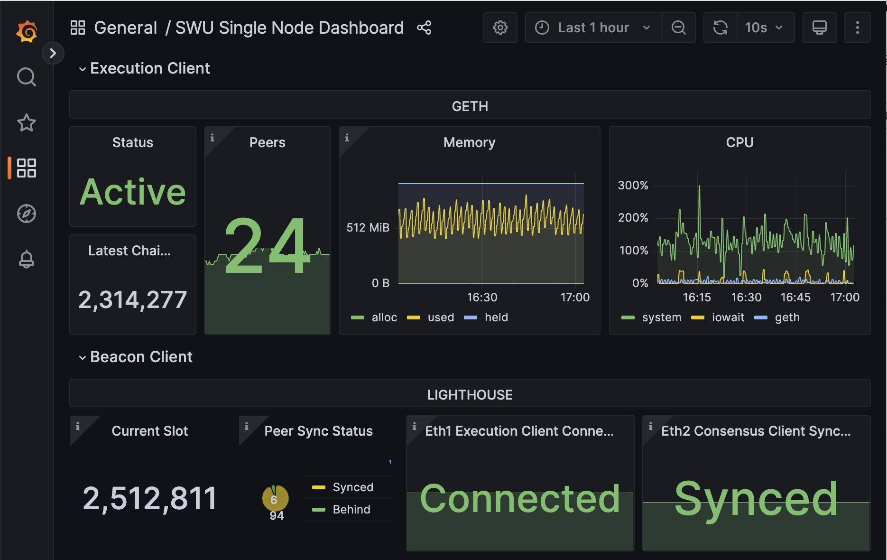

# Eth-node
This project provides infrastructure for deploying an Ethereum node via `geth` and `lighthouse beacon`, with integrated monitoring and alerting using Prometheus, Grafana, and Alertmanager. Monitoring is performed using Grafana dashboards to track the node's state and logs, while alerting is configured to send notifications to Telegram through Alertmanager.  
[Demo instance dashboard](http://206.189.0.110/d/singlenode/swu-single-node-dashboard?orgId=1&refresh=10s).  
[Demo alerts](https://t.me/+P3Xr4vee3jExMGVi)



## Deployment

1. Install Docker: [Docker Installation Guide](https://docs.docker.com/engine/install/ubuntu/)
2. Checkout the project:
```
bash   git clone https://github.com/aleksandrrodnin/eth-node  
cd node_exporter
   ```
3. Configure Alert Manager:
```bash
nano ./alertmanager/alertmanager.yml
```  
   Fill in the following: 

    - `PUT_YOUR_BOT_TOKEN_HERE`  
    - `PUT_YOUR_CHAT_ID_HERE`

   These values can be obtained using [BotFather](https://t.me/BotFather).

4. Start the project:
```bash 
docker-compose up -d
```

## Provisioning

### Localhost

- [Geth and Beacon Dashboard](http://localhost/d/singlenode/swu-single-node-dashboard?orgId=1&refresh=10s)
- [Geth logs](http://localhost/explore?orgId=1&left=%7B%22datasource%22:%22loki%22,%22queries%22:%5B%7B%22refId%22:%22A%22,%22expr%22:%22%7Bjob%3D%5C%22geth%5C%22%7D%20%7C%3D%20%60%60%22,%22queryType%22:%22range%22,%22datasource%22:%7B%22type%22:%22loki%22,%22uid%22:%22loki%22%7D,%22editorMode%22:%22builder%22%7D%5D,%22range%22:%7B%22from%22:%22now-1h%22,%22to%22:%22now%22%7D%7D)
- [Beacon logs](http://localhost/explore?orgId=1&left=%7B%22datasource%22:%22loki%22,%22queries%22:%5B%7B%22refId%22:%22A%22,%22expr%22:%22%7Bjob%3D%5C%22lighthouse%5C%22%7D%20%7C%3D%20%60%60%22,%22queryType%22:%22range%22,%22datasource%22:%7B%22type%22:%22loki%22,%22uid%22:%22loki%22%7D,%22editorMode%22:%22builder%22%7D%5D,%22range%22:%7B%22from%22:%22now-1h%22,%22to%22:%22now%22%7D%7D)

### Test instance

- [Geth and Beacon Dashboard](http://206.189.0.110/d/singlenode/swu-single-node-dashboard?orgId=1&refresh=10s)
- [Geth logs](http://206.189.0.110/explore?orgId=1&left=%7B%22datasource%22:%22loki%22,%22queries%22:%5B%7B%22refId%22:%22A%22,%22expr%22:%22%7Bjob%3D%5C%22geth%5C%22%7D%20%7C%3D%20%60%60%22,%22queryType%22:%22range%22,%22datasource%22:%7B%22type%22:%22loki%22,%22uid%22:%22loki%22%7D,%22editorMode%22:%22builder%22%7D%5D,%22range%22:%7B%22from%22:%22now-1h%22,%22to%22:%22now%22%7D%7D)
- [Beacon logs](http://206.189.0.110/explore?orgId=1&left=%7B%22datasource%22:%22loki%22,%22queries%22:%5B%7B%22refId%22:%22A%22,%22expr%22:%22%7Bjob%3D%5C%22lighthouse%5C%22%7D%20%7C%3D%20%60%60%22,%22queryType%22:%22range%22,%22datasource%22:%7B%22type%22:%22loki%22,%22uid%22:%22loki%22%7D,%22editorMode%22:%22builder%22%7D%5D,%22range%22:%7B%22from%22:%22now-1h%22,%22to%22:%22now%22%7D%7D)

## Solution description
This repository contains a `docker-compose.yml` configuration for running an Ethereum Geth node, a Lighthouse beacon node, and a monitoring stack (Prometheus, Grafana, Loki, Promtail, and Alertmanager).

### Ethereum Node (Geth)

- **Image**: `ethereum/client-go:v1.14.8`
- **Ports**:
  - `6060`: Metrics endpoint
  - `8545`: JSON-RPC endpoint
  - `30303`: P2P networking
- **Command Options**:
  - Syncs with the Holesky testnet
  - Enables HTTP and authentication RPC interfaces
  - Logs are stored at `/root/.ethereum/logs/geth.log`

### Lighthouse Beacon Node

- **Image**: `sigp/lighthouse:v5.3.0`
- **Ports**:
  - `5054`: Metrics endpoint
  - `5052`: HTTP API
  - `9000`: P2P networking
- **Command Options**:
  - Syncs with Holesky and uses Geth as the execution layer

### Prometheus

- **Image**: `prom/prometheus:v2.43.0`
- **Port**: `9090`
- **Configuration**: Configured via `prometheus.yml` to scrape metrics from Geth, Lighthouse, and other services.

### Grafana

- **Image**: `grafana/grafana:9.4.7`
- **Port**: `80` (accessible via `localhost`)
- **Configuration**: Pre-configured to use Prometheus as a data source and dashboards.

### Loki

- **Image**: `grafana/loki:2.8.2`
- **Logging**: Centralized log aggregation for Geth and Lighthouse logs.

### Promtail

- **Image**: `grafana/promtail:2.8.2`
- **Log Source**: Collects logs from Geth and Lighthouse for Loki.

### Alertmanager

- **Image**: `prom/alertmanager`
- **Port**: `9093`
- **Configuration**: Sends alerts based on rules defined in `alert_rules.yml`